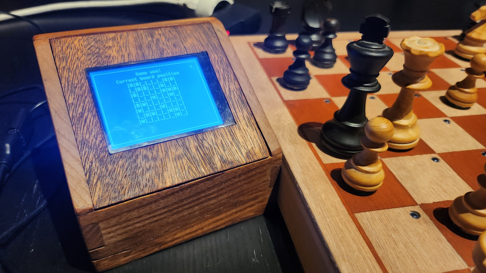
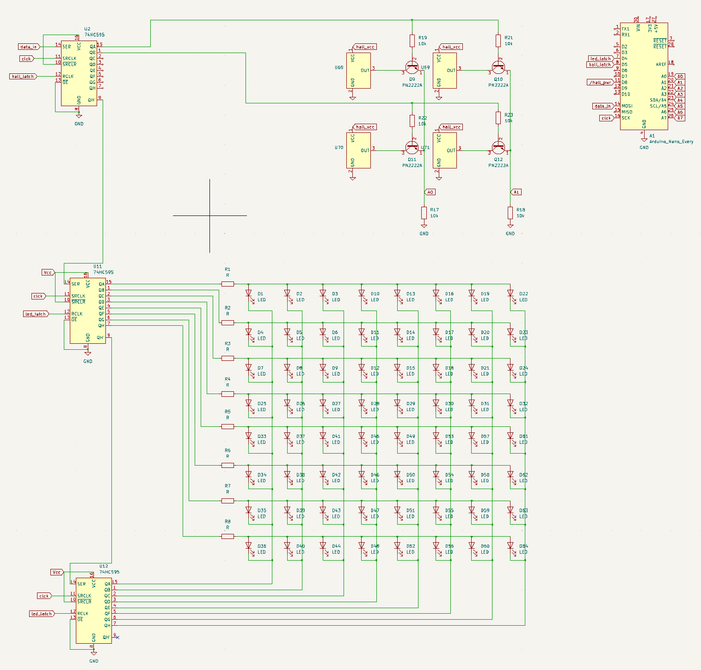
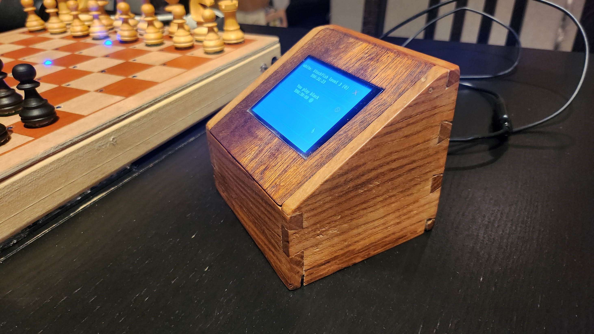

# eChess: play online chess, but over the board

https://github.com/user-attachments/assets/bde2e431-92bb-4959-bb7b-e80072c71205

_Demo game against a lichess bot. The phone showcases the game for demo purposes, but isn't actually required to play_

## How it works

- The board is equipped with 64 hall effect sensors, and 64 LEDs.
- The board can communicate via usb to a nodejs program that runs on an embedded raspberry PI with touchscreen
- The program can communicate with both lichess API and the physical board

### Piece detection

The general principle is to hide magnetic hall effect sensors under the board to detect piece presence. White & black pieces have a hidden magnet in them, in different orientations, respectively

Using linear sensors we are then able to detect between 3 distinct states:

- white piece (low voltage)
- black piece (high voltage)
- no piece (~ half the supply voltage)

In addition to the sensors, a 8x8 LED matrix is used to display the opponent's moves on the board. An arduino microcontroller interfaces with an embedded go program to control the LEDs, read the sensors, and communicate with the lichess API.

## Showing the moves

Each square is equipped with a blue LED that can be lit to signal the opponent's move. It's bright enough that we don't miss a move, and discreet enough that it doesn't distract from the game.

## The electronics

For the board to work, is is necessary to:

- read inputs from the program, and light any combination of leds on a 8x8 grid
- read the state of 64 hall effect sensors in near real time, and send the state to the program whenever a change is detected

Since the arduino has a limited number of pins, two 74HC595 shift registers are used to control the LEDs with multiplexing, and an additional 74HC4051 multiplexer is used to control the sensor rows. Each of the sensor outputs are connected to one of the analog inputs of the microcontroller (arduino conveniently has 8 of them).

### The sensor matrix

According to their spreadsheet, the power-on time of the the hall sensors is somewhere from 175μs to 300μs. This is slow enough that we can't use multiplexing to power the sensors. Instead I went for a 8x8 matrix where all of the sensors are always powered. Their input readings are then selected using some BJT transistors whose switch time is in the order of 30ns (so about 8 500 times faster than the sensors power-on time)

<figure>

<figcaption>Details of the sensor matrix, only 4 sensors are shown. Sending <i>QA=1</i>, <i>QB=0</i> and reading <i>A1</i> input would provide a reading of the bottom-right sensor of this diagram</figcaption>
</figure>

### Electronics overview

The three 74HC595 shift registers are chained, and connected to the arduino as follows(only 4 sensors are shown for simplicity):

_complete overview of the electronics. Full kiCad files can be found in the [kiCad](kiCad) directory_

With this setup, [the microcontroller](arduino/arduino.ino) can use multiplexing to control the LEDs and read the sensors in near real time, while using very few pins from the microcontroller.

### The final build

For the build I soldered 64 leds, hall effect sensors, and transistors directly to a wooden board I build and painted. The shift-register ICs are wired to the microcontroller thanks to a custom PCB [ whose files can be found here ](eBoard_pcb)

_soldered pcb with arduino nano, IC sockets and some connectors_

_internal view of the board_

_closeup of the pcb after installation_

## Microconctroller setup

Arduino nano is used. It's cheap, small, and conveniently has 8 analog inputs, which is perfect for this use case.

## workflow

The arduino loop does the following:

1. **Read all the sensors**

   Using multiplexing, read all states from the 64 hall sensors and build a board state from it. If a state change is detected, then we serialize the board state and send it to the computer.

2. **Read the LED input state**

   Read from usb and set the desired LED state

3. **Display the LEDs**

   For each lit LED from the input state, light the corresponding LED on the board, wait 2ms, and turn it off.

Since we are multiplexing the display, the entire loop needs to be _fast_. Fast enough that you don't see any flickering while we are reading 64 sensors and communicating via USB between each LED blink.

## Serializing the position

A chess board has a very convenient size of 8x8, which allows to represent a row with exactly two bytes:

- first byte signals positions of white pieces on row _a_
- second byte signals positions of black pieces on row _a_
- third byte signals positions of white pieces on row _b_
- ...etc until 16 bytes are sent to fully represent the board
- at the end of a serialization, three 255 bytes are sent to signal the end of the transmission. Since (255, 255, 255) would represent at least one row filled with both white _and_ black pieces, there is no ambiguity in the transmission.

This protocol allows the board to send partial states between led blinks, which removes any flickering from the display. The program can wait for a (255, 255, 255) sequence to know that the board state is fully transmitted, and in case of data corruption, it can ignore a broken state, and start over everytime a (255, 255, 255) sequence is detected.

_Example of how a row with 2 white pieces and 1 black piece would be encoded_

## The program

Lastly, the main program is written in go, and communicates with the arduino. It will read both the board state and the game moves from lichess to reconcilate the position, and determine when a move should be played (_i.e._ sent to the server), or when some LEDs should be lit. The user interface is provided by a touchscreen, and everything runs on a raspberry zero.

The code can be found in [the app directory](goapp/)

## Conclusion

I've been playing with this board for quite a while now, and it has been a tremendous experience so far. It's definitely not suited for fast time controls, but lichess only provide their real-time API for rapid & classical time-controls anyway (has to do with anti-cheating measures I believe).

Playing lichess games while looking at a physical board is a delight, and has become my main way of playing chess at home.
